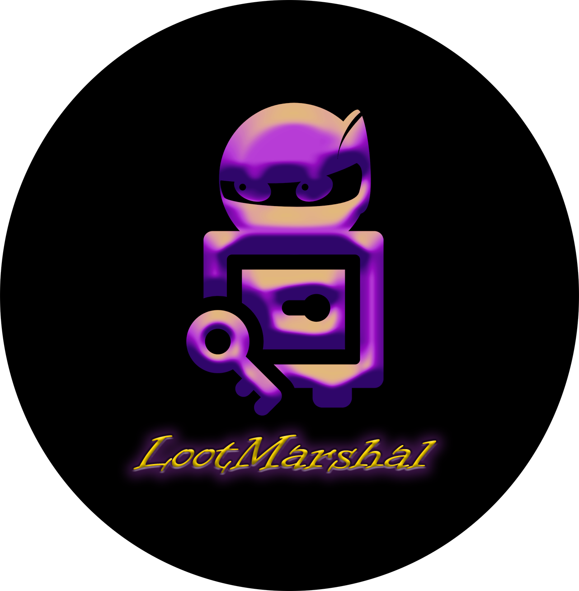

<div align="center">
    
</div>

# LootMarshal

LootMarshal is an API server used to manage storage of credentials and files. Pentesters and Red Teamers tend to organize credentials and files of interesting in a variety of ways and LootMarshal aims to help keep testers organized.

## Getting Started

### Prerequisites

- Python 3.8

### Installing

LootMarshal is written in a [Poetry](https://python-poetry.org/) environment. However, a `requirements.txt` has also been provided for other virtual environments. It is **HIGHLY RECOMMENDED** that you install this tool in a virtual environment.

**Poetry:** `poetry install`

**Pipenv:** `pipenv install -r requirements.txt`

**Pip:** `pip install -r requirements.txt`

## Usage

LootMarshal is provided as two parts: Server and CLI. While the CLI provided will be kept up to parity with server functions, you are free to implement your own CLI to interact with the server in any manner you'd like.

### Implement your backend handler
Currently, the available backends available for LootMarshal are:

- Azure

**Azure**

1. Create credentials for LootMarshal to use. LootMarshal can only be configured to run with a Service Principal client ID and secret (more credential types may be supported in the future). **Maintain the credentials as a secret!**
https://docs.microsoft.com/en-us/azure/active-directory/develop/howto-create-service-principal-portal


2. Create a Key Vault and Storage account. Provide appropriate permissions to the resources for the Service Principal. (Contributor access to the vault and storage account only is sufficient).

Key Vault: https://docs.microsoft.com/en-us/azure/key-vault/general/overview-security<br>
Storage: https://docs.microsoft.com/en-us/azure/storage/common/storage-auth-aad-rbac-portal


### Configure settings

Before running LootMarshal, you must configure the settings for the server to use. These settings can be found in the `lootmarshal/settings/settings.env` file. 

### Launch the server

```
python lootmarshal.py server
INFO:     Started server process [19000]
INFO:     Waiting for application startup.
INFO:     Application startup complete.
INFO:     Uvicorn running on http://127.0.0.1:4008 (Press CTRL+C to quit)
```
To see what endpoints are currently exposed, you can visit http://127.0.0.1:4008/docs or http://127.0.0.1:4008/redoc to view the API.

## Using the LootMarshal CLI

The documentation for the LootMarshal CLI can be found [here](docs/cli.md)


## Built With

* [FastAPI](https://fastapi.tiangolo.com/) - The web framework used
* [Typer](https://typer.tiangolo.com/) - The CLI Framework used

## Future development
**Plan: (6/28)**

- Implement Azure Storage
- Implement SSL
- Add additional credential parsing features
- Add tagging features for secrets

## Notes

**This project is being written as a project for Dakota State University's CSC-842 Security Tool Development course and may or may not be supported in the future!**

## License

This project is licensed under the MIT License - see the [LICENSE.md](LICENSE.md) file for details

